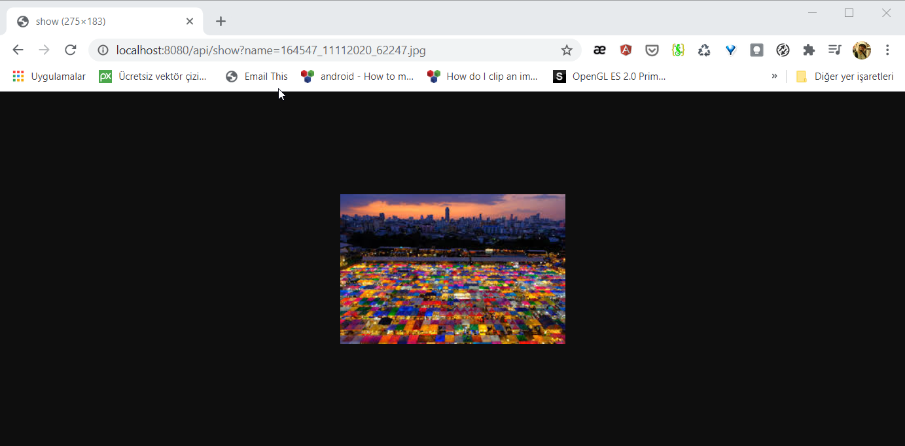
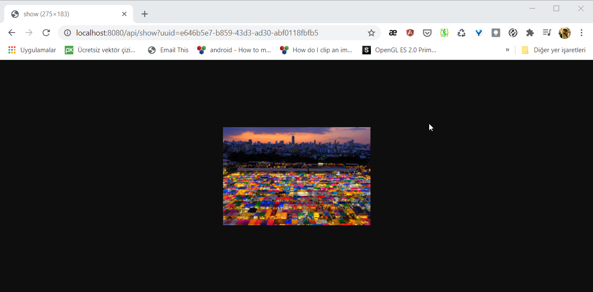
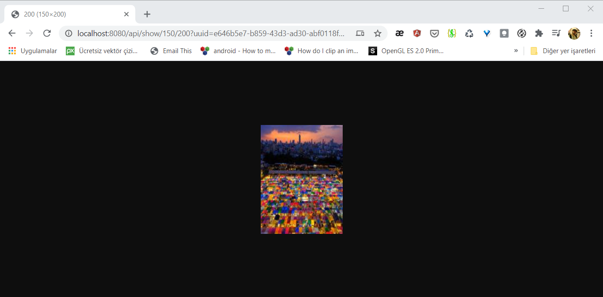
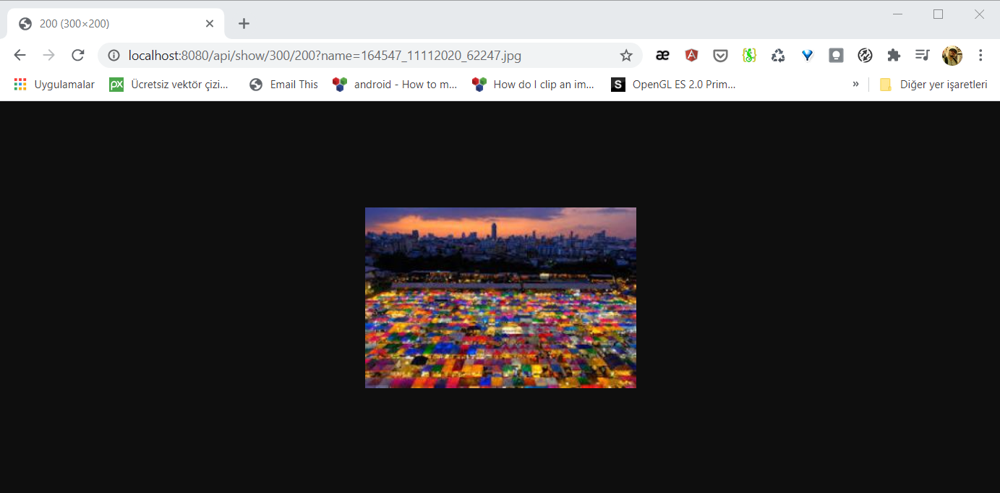
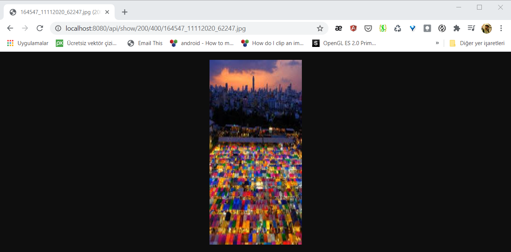
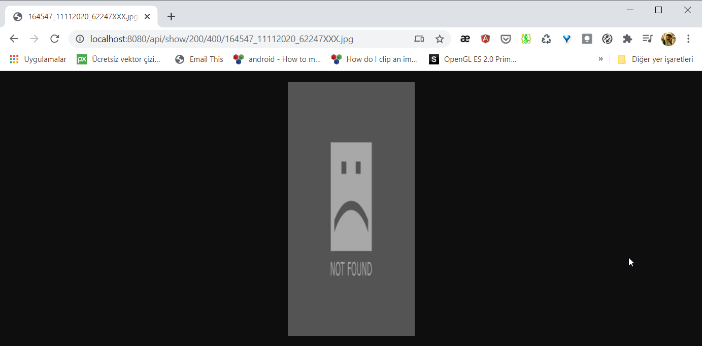

# ImageServer with Spring Boot & PostgreSQL

This project provides to upload files and preview images. It's simply serving images via url.


You can easily use for your requirements.

* [Rest APIs](#rest-apis)
* [Demo](#demo)
* [Usage Of Project](#usage-of-project)

## Rest APIs

Added methods and their usage like below;


##### Endpoints

```bash

General Endpoints

GET 	/api/images  		list all image informations

Upload Image Endpoints

POST	/api/upload		upload single image
POST	/api/uploads		upload multi image

Preview Endpoints

GET		/api/show/FILE_NAME
GET		/api/show?name=FILE_NAME
GET		/api/show?uuid=FILE_UUID
GET		/api/show/150/200?uuid=FILE_UUID
GET		/api/show/300/200?name=FILE_NAME
GET		/api/show/200/400/FILE_NAME
```


>Get all image info request

```bash
 curl -X GET http://localhost:8080/api/images | json_pp
```
>Get all image info response

```json
[
   {
      "fileName" : "105747_11112020_69052.jpg",
      "fileType" : "image/jpeg",
      "size" : 6344,
      "uuid" : "caf2a1ad-8dfd-4ec5-8b32-a73c6458a382"
   },
   {
      "fileName" : "140209_11112020_60346.jpg",
      "fileType" : "image/jpeg",
      "size" : 6344,
      "uuid" : "88a2570c-5e38-480d-9cd7-1172cc03f10b"
   },
   {
      "fileName" : "140227_11112020_51882.jpg",
      "fileType" : "image/jpeg",
      "size" : 6344,
      "uuid" : "7a5ced06-bd10-4eae-ae01-bba8a64c10fe"
   }
]

```

>Upload single image request.

```bash
curl -X POST -H "Content-Type: multipart/form-data"  -F "file=@image1.jpg" http://localhost:8088/api/upload  | json_pp
```
>Upload single image response.
```json	
{
   "fileName" : "164428_11112020_88984.jpg",
   "fileType" : "image/jpeg",
   "size" : 6344,
   "uuid" : "b4ebe83b-5013-43ff-a379-87a053bd718e"
}
```

>Upload multiple image request.

```bash
curl -X POST -H "Content-Type: multipart/form-data"  -F "files=@image1.jpg" -F "files=@image2.jpg" -F "files=@image3.jpg" http://localhost:8080/api/uploads | json_pp
```

>Upload multiple image response.

```json
[
   {
      "fileName" : "164547_11112020_52367.jpg",
      "fileType" : "image/jpeg",
      "size" : 6344,
      "uuid" : "76831015-1426-44d1-b34e-1044e9f3c83f"
   },
   {
      "fileName" : "164547_11112020_67882.jpg",
      "fileType" : "image/jpeg",
      "size" : 4889,
      "uuid" : "9b4c89cf-3cbf-4b79-bf0e-e488365c56a2"
   },
   {
      "fileName" : "164547_11112020_62247.jpg",
      "fileType" : "image/jpeg",
      "size" : 22152,
      "uuid" : "e646b5e7-b859-43d3-ad30-abf0118fbfb5"
   }
]
```


> Get image with name

Sample Data:

```json
   {
      "fileName" : "164547_11112020_62247.jpg",
      "fileType" : "image/jpeg",
      "size" : 22152,
      "uuid" : "e646b5e7-b859-43d3-ad30-abf0118fbfb5"
   }
```

<br />

> http://localhost:8080/api/show/164547_11112020_62247.jpg

> Response

<br />
<br />

<p align="center">
  
</p>

<br />

> http://localhost:8080/api/show?name=164547_11112020_62247.jpg

<br />
<br />

<p align="center">
  
</p>

<br />

> http://localhost:8080/api/show?uuid=e646b5e7-b859-43d3-ad30-abf0118fbfb5

<br />
<br />

<p align="center">
  
</p>

<br />

> http://localhost:8080/api/show/150/200?uuid=e646b5e7-b859-43d3-ad30-abf0118fbfb5

<br />
<br />

<p align="center">
  
</p>

<br />

> http://localhost:8080/api/show/300/200?name=164547_11112020_62247.jpg

<br />
<br />

<p align="center">
  
</p>

<br />

> http://localhost:8080/api/show/200/400/164547_11112020_62247.jpg

<br />
<br />

<p align="center">
  
</p>

<br />

> http://localhost:8080/api/show/200/400/164547_11112020_62247XXX.jpg

<br />
If you would like to preview an image with wrong name or uuid, you will see the default image.
<br />
<br />


<p align="center">
  
</p>

<br />
<br />

> Get all image names in server request.

```bash
curl -X GET http://localhost:8080/listImages | json_pp
```
> Get all image names in server response.

```json
[
    {
        "preview" : "http://localhost:8080/preview/073e8b03-1260-4018-b697-932aa25720c7.PNG",
        "name" : "073e8b03-1260-4018-b697-932aa25720c7.PNG"
    },
    {
        "name" : "084347_20112019_OTQDOMRP.jpg",
        "preview" : "http://localhost:8080/preview/084347_20112019_OTQDOMRP.jpg"
    },
    {
        "name" : "12Factor.PNG",
        "preview" : "http://localhost:8080/preview/12Factor.PNG"
    },
    {
        "name" : "163351_19112019_ARHAWFUL.PNG",
        "preview" : "http://localhost:8080/preview/163351_19112019_ARHAWFUL.PNG"
    },
    {
        "preview" : "http://localhost:8080/preview/163653_19112019_CREMROBE.PNG",
        "name" : "163653_19112019_CREMROBE.PNG"
    }
    ....
]
```


## Demo


## Usage Of Project


## Steps to Setup

**1. Clone the repository** 

```bash
git clone https://github.com/coderkan/imageserver.git
```


**2. Run the app using maven**

```bash
cd imageserver
mvn spring-boot:run
```

That's it! The application can be accessed at `http://localhost:8080`.

You may also package the application in the form of a jar and then run the jar file like so -

```bash
mvn clean package
java -jar target/imageserver-0.0.1-SNAPSHOT.jar
```